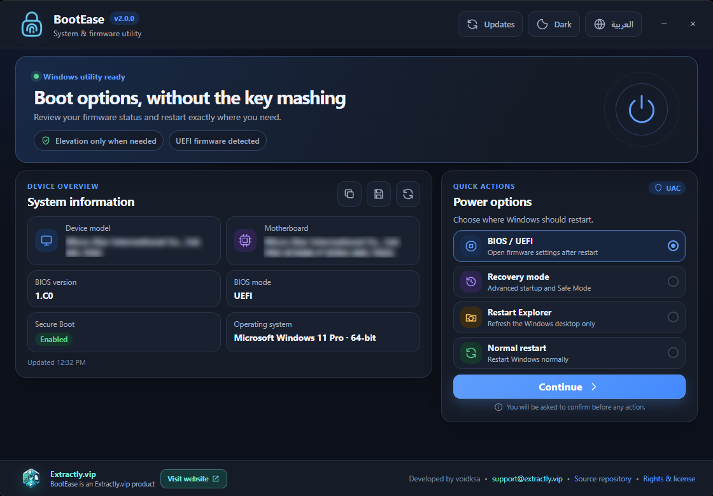

<div align="center">
  
  <h1>BootEase</h1>
  <p><strong>Direct access to Windows firmware and recovery options.</strong></p>
  <p>
    <a href="https://github.com/voidksa/BootEase/releases/latest"></a>
    
    <a href="LICENSE"></a>
  </p>
  <p><a href="README.md">English</a> · <a href="README_AR.md">العربية</a></p>
  <p>
    <a href="https://extractly.vip/"></a><br />
    <sub>An <a href="https://extractly.vip/">Extractly.vip</a> product, developed by voidksa</sub>
  </p>
</div>

## Overview

BootEase is a focused Windows desktop utility for opening BIOS/UEFI firmware settings, Windows Recovery, or performing common restart actions without relying on startup key timing.

Version 2 is rebuilt with Electron and TypeScript. It introduces a bilingual interface, proper right-to-left support, complete system information, selective UAC elevation, and installer and portable distributions for Windows x64.

<div align="center">
  
</div>

## Capabilities

| Area | What BootEase provides |
| --- | --- |
| Firmware access | Restart directly into BIOS/UEFI settings on supported systems. |
| Recovery | Open Windows Advanced Startup and recovery options. |
| Restart actions | Restart Windows normally or restart Windows Explorer only. |
| System information | View the device, motherboard, BIOS version and mode, Secure Boot status, operating system, and architecture. |
| Language and appearance | English and Arabic interfaces with full RTL support, plus light, dark, and system themes. |
| Export | Copy system details to the clipboard or save them as a text file. |
| Update checks | Compare the installed version with the latest public GitHub release. |
| Command line | Launch supported restart actions from scripts or shortcuts. |

## Download

Download the latest build from the [GitHub Releases](https://github.com/voidksa/BootEase/releases/latest) page.

| Package | Recommended use |
| --- | --- |
| `BootEaseSetup-2.0.0-x64.exe` | Installs BootEase, creates shortcuts, and provides standard uninstallation. Recommended for regular use. |
| `BootEasePortable-2.0.0-x64.exe` | Runs directly without installation. Useful for testing or carrying on removable storage. |

BootEase supports Windows 10 and Windows 11 on x64 systems.

## Safety model

BootEase runs with normal user permissions. It requests UAC elevation only after you select and confirm an operation that requires administrative access.

The Electron renderer is sandboxed and isolated from privileged Windows operations. Navigation, popups, webviews, and permission requests are blocked, while IPC commands and external links are restricted to explicit allowlists.

Restart and firmware actions can close active applications. Save your work before confirming an action.

## Command-line options

```text
BootEase.exe /bios
BootEase.exe /recovery
BootEase.exe /safe
BootEase.exe /restart
```

The `-option` and `--option` forms are also accepted. `/safe` opens the same Windows recovery flow as `/recovery`.

## Build from source

Requirements:

- Windows 10 or Windows 11 x64
- Node.js 22 or newer
- npm 11 or newer

```powershell
git clone https://github.com/voidksa/BootEase.git
cd BootEase\electron-app

npm install
npm test
npm run build

# Build the installer and portable executable
npm run dist:win
```

Generated packages are written to `electron-app/release/`. BootEase 2.x source is maintained in [`electron-app`](electron-app/). Previous versions remain available through the repository tags and release history.

## License and ownership

BootEase is free software licensed under the [GNU General Public License v3.0](LICENSE). Distributed copies and modifications must follow the GPLv3 requirements and preserve applicable copyright and license notices.

BootEase is owned and maintained by [Extractly.vip](https://extractly.vip/) and was originally developed by **voidksa**. See [NOTICE.md](NOTICE.md) for attribution details. Product support is available at [support@extractly.vip](mailto:support@extractly.vip).

## Contributing

Issues and pull requests are welcome. Keep changes focused, document user-visible behavior, and run the test suite before submitting a pull request.
