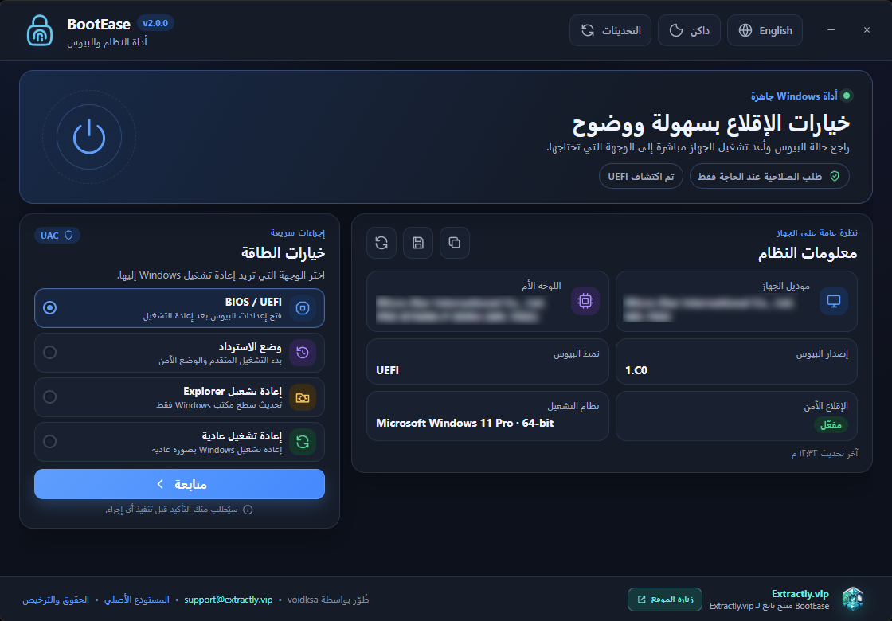

<div dir="rtl" align="center">
  
  <h1>BootEase</h1>
  <p><strong>وصول مباشر إلى خيارات البيوس والاسترداد في Windows.</strong></p>
  <p>
    <a href="https://github.com/voidksa/BootEase/releases/latest"></a>
    
    <a href="LICENSE"></a>
  </p>
  <p>
    <a href="https://github.com/voidksa/BootEase/releases/download/v2.0.0/BootEaseSetup-2.0.0-x64.exe"></a>
    <a href="https://github.com/voidksa/BootEase/releases/download/v2.0.0/BootEasePortable-2.0.0-x64.exe"></a>
  </p>
  <p><a href="README.md">English</a> · <a href="README_AR.md">العربية</a></p>
  <p>
    <a href="https://extractly.vip/"></a><br />
    <sub>منتج تابع لـ <a href="https://extractly.vip/">Extractly.vip</a>، طُوّر بواسطة voidksa</sub>
  </p>
</div>

<div dir="rtl">

## نبذة

BootEase أداة مكتبية متخصصة لنظام Windows تتيح الدخول إلى إعدادات BIOS/UEFI أو خيارات استرداد Windows وتنفيذ إجراءات إعادة التشغيل الشائعة، من دون الاعتماد على توقيت الضغط على مفاتيح الإقلاع.

أُعيد بناء الإصدار الثاني باستخدام Electron وTypeScript. يقدم هذا الإصدار واجهة عربية وإنجليزية، ودعمًا كاملًا لاتجاه RTL، ومعلومات واضحة عن النظام، وطلب صلاحية UAC عند الحاجة فقط، إضافة إلى نسخة تثبيت ونسخة محمولة لأنظمة Windows بمعمارية x64.

<div align="center">
  
</div>

## الإمكانات

| القسم | ما يقدمه BootEase |
| --- | --- |
| إعدادات البيوس | إعادة التشغيل والدخول مباشرة إلى إعدادات BIOS/UEFI في الأجهزة المدعومة. |
| الاسترداد | فتح خيارات بدء التشغيل المتقدم والاسترداد في Windows. |
| إعادة التشغيل | إعادة تشغيل Windows بصورة عادية أو إعادة تشغيل Windows Explorer فقط. |
| معلومات النظام | عرض الجهاز واللوحة الأم وإصدار البيوس ونمطه وحالة الإقلاع الآمن ونظام التشغيل والمعمارية. |
| اللغة والمظهر | واجهة عربية وإنجليزية مع دعم RTL، ومظهر فاتح أو داكن أو متوافق مع إعداد النظام. |
| التصدير | نسخ معلومات النظام إلى الحافظة أو حفظها في ملف نصي. |
| التحديثات | مقارنة الإصدار المثبت بأحدث إصدار عام منشور على GitHub. |
| سطر الأوامر | تشغيل إجراءات إعادة التشغيل المدعومة من الاختصارات والبرامج النصية. |

## التحميل

اختر النسخة المناسبة أدناه، أو افتح صفحة [أحدث إصدار](https://github.com/voidksa/BootEase/releases/latest) لقراءة ملاحظات الإصدار وبصمات الملفات.

| الملف | الاستخدام المناسب |
| --- | --- |
| [تحميل `BootEaseSetup-2.0.0-x64.exe`](https://github.com/voidksa/BootEase/releases/download/v2.0.0/BootEaseSetup-2.0.0-x64.exe) | يثبت BootEase وينشئ الاختصارات ويوفر إزالة تثبيت اعتيادية. هو الخيار الموصى به للاستخدام الدائم. |
| [تحميل `BootEasePortable-2.0.0-x64.exe`](https://github.com/voidksa/BootEase/releases/download/v2.0.0/BootEasePortable-2.0.0-x64.exe) | يعمل مباشرة من دون تثبيت. مناسب للتجربة أو التشغيل من وحدة تخزين خارجية. |

يدعم BootEase نظامي Windows 10 وWindows 11 بمعمارية x64.

## نموذج الأمان

يعمل BootEase بصلاحيات المستخدم العادية، ولا يطلب صلاحية UAC إلا بعد اختيارك وتأكيدك لعملية تحتاج إلى صلاحيات المسؤول.

واجهة Electron معزولة داخل Sandbox عن عمليات Windows ذات الصلاحيات المرتفعة. كما تُحظر عمليات التنقل والنوافذ المنبثقة وWebView وطلبات الأذونات، وتُقيد أوامر IPC والروابط الخارجية بقوائم سماح محددة.

قد تؤدي إجراءات إعادة التشغيل والدخول إلى البيوس إلى إغلاق التطبيقات المفتوحة. احفظ عملك قبل تأكيد أي إجراء.

## خيارات سطر الأوامر

```text
BootEase.exe /bios
BootEase.exe /recovery
BootEase.exe /safe
BootEase.exe /restart
```

يدعم البرنامج أيضًا الصيغتين `-option` و`--option`. يفتح الخيار `/safe` مسار الاسترداد نفسه الذي يفتحه `/recovery`.

## البناء من المصدر

المتطلبات:

- Windows 10 أو Windows 11 بمعمارية x64
- Node.js 22 أو أحدث
- npm 11 أو أحدث

```powershell
git clone https://github.com/voidksa/BootEase.git
cd BootEase\electron-app

npm install
npm test
npm run build

# إنشاء المثبت والنسخة المحمولة
npm run dist:win
```

تُنشأ ملفات التوزيع داخل `electron-app/release/`. يوجد مصدر BootEase 2.x داخل مجلد [`electron-app`](electron-app/)، وتبقى الإصدارات السابقة متاحة عبر الوسوم وسجل الإصدارات في المستودع.

## الترخيص والملكية

BootEase برنامج حر مرخص بموجب [GNU General Public License v3.0](LICENSE). يجب أن تلتزم النسخ والتعديلات الموزعة بمتطلبات GPLv3 وأن تحافظ على إشعارات حقوق النشر والترخيص المطبقة.

BootEase مملوك وتتم صيانته بواسطة [Extractly.vip](https://extractly.vip/)، وطُوّر في الأصل بواسطة **voidksa**. راجع [NOTICE.md](NOTICE.md) لتفاصيل نسب الحقوق. يتوفر دعم المنتج عبر [support@extractly.vip](mailto:support@extractly.vip).

## المساهمة

نرحب بالمشكلات وطلبات السحب. اجعل التغييرات محددة، ووثّق السلوك الظاهر للمستخدم، وشغّل الاختبارات قبل إرسال طلب السحب.

</div>
